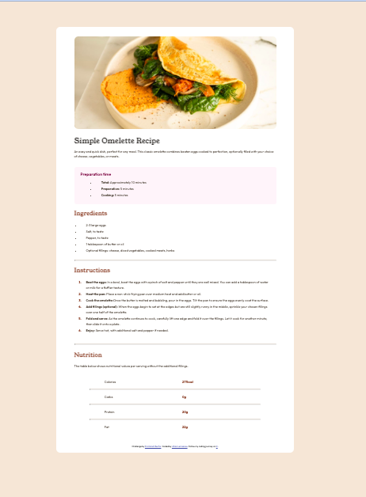

# Frontend Mentor - Recipe page solution

This is a solution to the [Recipe page challenge on Frontend Mentor](https://www.frontendmentor.io/challenges/recipe-page-KiTsR8QQKm). Frontend Mentor challenges help you improve your coding skills by building realistic projects.

## Table of contents

- [Overview](#overview)
  - [The challenge](#the-challenge)
  - [Screenshot](#screenshot)
  - [Links](#links)
- [My process](#my-process)
  - [Built with](#built-with)
  - [What I learned](#what-i-learned)
  - [Continued development](#continued-development)
- [Author](#author)

## Overview

This is a simple HTML and CSS Responsive webpage. I used a mobile first approach, and tweaked the design slightly for the desktop version. I used limited resources on this project, although StackOverFlow and Chat GPT helped me out on a few spots where my memory failed me. This project was a great review for HTML and CSS. I even got to learn a few new things which was great!

### Screenshot

Here is a screenshot of the webpage at the desktop screen size.

### Links

- Solution URL: [Add solution URL here](https://your-solution-url.com)
- Live Site URL: [Add live site URL here](https://your-live-site-url.com)

## My process

I first look over the mobile and desktop designs to get a feel of how to style the page.

Once I figure out what kind of styling I need (will I need flexbox/grid? How should the mobile look compared to desktop version-will I need to convert to flexbox? What elements on the page will have the same styling, what aspects need to be styled uniquely? etc.), I can determine how to structure my HTML so that I am able to set up classes, IDs, and HTML elements properly.

I like to start from the top of the page and work down, working mobile to desktop. Desktop tends to fit together nicely, or need less changes, once the mobile version is set up well.

### Built with

- Semantic HTML5 markup
- CSS custom properties
- Flexbox
- Mobile-first workflow

### What I learned

I used this project as more of a review to refresh my knowledge of HTML and CSS. I have been working on JavaScript for a while now and had not been typing up any HTML or CSS. I was really in need of a refresher, which this project was excellent for basic layout and styling.

There were a few things I learned about!

- CSS ::marker which selects the bullet or number in a list-item. This is what I used to change the color of the numbered list.

- CSS variables which I had heard about before, but never used myself. I went ahead and tried them on this project using variables for font family and colors. Super simple to use and very handy!

- 
 which gives you a divider on the page, which you can then style in CSS. I used this to divide different sections on the webpage.

### Continued development

- I still have some things to learn about HTML tags like how to use the tags to help the website's SEO, so this is something I would like to learn more about, although I did not use it in this particular project.

- I would also like to learn more about accessibility on the web and how I can implement that into my websites, as right now my knowledge is very limited.

- I would like to continue practicing CSS with a lot of different projects. I need more practice on grid, as I have not used it in a project.

- I am going to take this simple HTML and CSS recipe page and add on to it for more of a challenge. I will add more complex CSS and some JavaScript to it as well.

## Author

- Frontend Mentor - [@jillianlemsanes](https://www.frontendmentor.io/profile/jillianlemsanes)
- Twitter - [@Jlemsanes](https://www.twitter.com/Jlemsanes)
